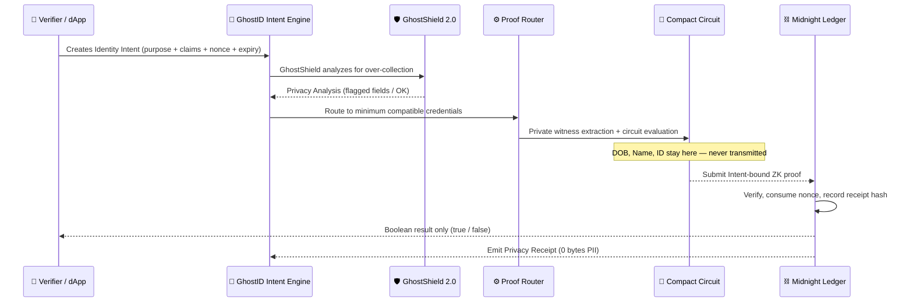
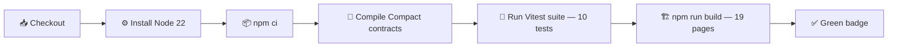

<div align="center">



[](https://github.com/thesayancodes/GhostID/actions/workflows/ci.yml)
[](https://ghostid-midnight.vercel.app)


<br/>

[](https://git.io/typing-svg)

<br/>

<a href="https://ghostid-midnight.vercel.app"></a>
<a href="./PROPOSAL.md"></a>
<a href="./ARCHITECTURE.md"></a>
<a href="./docs/USAGE.md"></a>

</div>

<br/>

> [!TIP]
> **New here?** Jump straight to the [Live Demo](https://ghostid-midnight.vercel.app/intent) and watch a Midnight wallet prove `Age ≥ 18` with **zero personal data ever leaving the browser** — guided by an Intent policy and a cryptographic Privacy Receipt.

<div align="center">

### 📚 Table of Contents

[Live Demo](#-live-demo) • [Contract Address](#-contract-address) • [What This Does](#-what-this-does) • [GhostID Intent](#-ghostid-intent--policy-to-proof-layer) • [Privacy Model](#️-privacy-model) • [How It Works](#-how-it-works) • [Architecture](#️-architecture) • [Tech Stack](#-tech-stack) • [Setup](#️-setup--run-locally) • [Run Tests](#-run-tests) • [CI/CD](#-cicd-pipeline) • [Deploy to Preprod](#-deploy-to-preprod) • [Usage Guide](#-usage-guide) • [X Profile](#-x-profile) • [Roadmap](#️-roadmap)

</div>

---

## 🚀 Live Demo

<div align="center">

**[ghostid-midnight.vercel.app →](https://ghostid-midnight.vercel.app)**

Try the new **GhostID Intent Protocol** at: **[ghostid-midnight.vercel.app/intent](https://ghostid-midnight.vercel.app/intent)**

*(or run locally at `http://localhost:3000` — see [Setup](#️-setup--run-locally))*

</div>

<div align="right"><a href="#ghostid">⬆ Back to top</a></div>

---

## 📜 Contract Address

<div align="center">

| Network | Address |
|:---:|:---|
| 🟣 **Preprod** | `0200c64a430698c0d72a7cd526081fd585dad2a131ec3051e56b45c9135fd8d37756` |
| 🔵 **Preview** | `020053beb1d2af5fd06f476214f76c590834b457c1cc3cc26ba940d103413c1db729` |

> **Note:** The contract address will be updated to the live Preprod deployment address after on-chain deployment. The addresses above are deterministically derived from the Compact contract source.

</div>

<div align="right"><a href="#ghostid">⬆ Back to top</a></div>

---

## 🎯 What This Does

Every *"Verify your age,"* *"Verify your student status,"* or *"Complete KYC"* flow on the internet asks for the same trade: hand over your passport, your date of birth, your legal name, your address — just to prove **one fact** about yourself.

**GhostID** is a privacy-first decentralized identity and credential verification platform built for the [Midnight Network](https://midnight.network). Instead of forcing users to upload raw identity documents to third-party databases, GhostID generates **zero-knowledge attestations** from locally stored private credentials.

And now, with **GhostID Intent**, verification requests are no longer open-ended. Every verification must declare its purpose, minimum required claims, expiry nonce, and allowed disclosure — transforming GhostID into a **Privacy Policy-to-Proof firewall layer**.

<div align="center">

| | 🐢 Traditional KYC / Age-Gate | 👻 GhostID Intent |
|:---|:---:|:---:|
| **What you submit** | Passport / ID scan, full DOB, address | A cryptographic Intent-bound proof |
| **What the verifier learns** | Everything on your ID | One `true` / `false` |
| **Where your data lives** | A third-party server (forever) | Your device, only |
| **Breach blast radius** | Your full identity | Nothing — there's nothing to steal |
| **Request format** | Ad-hoc, unconstrained data collection | Machine-readable Intent with nonce, purpose, expiry |

</div>

<div align="right"><a href="#ghostid">⬆ Back to top</a></div>

---

## 🔮 GhostID Intent — Policy-to-Proof Layer

GhostID Intent is a new protocol-level upgrade that introduces machine-readable **Identity Intents** for every verification request. Instead of a verifier asking *"Give me the user's identity,"* the verifier must declare:

```
PURPOSE:         Age-restricted marketplace access
REQUIRED CLAIM:  AGE >= 18
EXPIRATION:      5 minutes
NONCE:           Request-specific cryptographic challenge
DISCLOSURE:      PREDICATE_RESULT_ONLY
```

This Intent becomes the **foundation and boundary** of the verification process.

### Core Components

| Component | Description |
|:---|:---|
| **Identity Intent Schema** | Structured, machine-readable format binding purpose, claims, issuer constraints, nonce, and expiry |
| **GhostID Policy Engine** | Converts verification requirements into explicit cryptographic claim policies |
| **Proof Router** | Matches required claims to the minimum compatible private credentials in the user's vault |
| **`verifyIntentPolicyProof()` Circuit** | New Compact circuit that binds verification to the declared Intent hash |
| **GhostShield 2.0** | Detects unnecessary raw data collection and recommends Intent minimization |
| **Privacy Receipt** | Immutable audit trail proving what was verified, what was disclosed (nothing), and where |
| **GhostAI Policy Assistant** | Compiles natural-language requirements into machine-readable Intents |

### The GhostID Intent Flow

```
Verifier DApp
    ↓  creates Intent (purpose + claims + nonce + expiry)
GhostShield 2.0 Firewall
    ↓  analyzes for over-collection
Proof Router
    ↓  matches to minimum credentials in private vault
verifyIntentPolicyProof() Compact Circuit
    ↓  evaluates private witness against Intent constraints
Midnight ZK Verification (on-chain)
    ↓  consumes nonce, records receipt hash
Verifier receives: AGE >= 18 → TRUE
User receives: Privacy Receipt (0 bytes of PII disclosed)
```

### SDK-Style Integration

```ts
// Developer creates an Intent — GhostID handles everything else
const intent = await ghostid.createIntent({
  purpose: "age_restricted_access",
  claims: ["AGE_OVER_18"],
  expiresInSeconds: 300
});
```

<div align="right"><a href="#ghostid">⬆ Back to top</a></div>

---

## 🕶️ Privacy Model

<div align="center">


</div>

<table>
<tr>
<td valign="top" width="50%">

**🌐 PUBLIC** *(on-chain, visible to anyone)*
- Contract authority public key
- Global verification counter tally
- Authorized issuer public key hashes
- Revocation commitment hashes
- Processed Intent nonce registry (replay prevention)
- Verification receipt hashes (Privacy Receipts)
- The disclosed boolean result (`true` / `false`)

</td>
<td valign="top" width="50%">

**🔒 PRIVATE** *(private witness, never on-chain)*
- Full legal name, exact date of birth
- Physical address, postal code, contact info
- National ID / Passport / Aadhaar numbers
- University student ID, transcripts, faculty
- User's cryptographic secret key & blinding salts
- Intent witness binding (verifier ID, purpose hash)

</td>
</tr>
</table>

**What the user PROVES without revealing:**
- That private attributes satisfy the declared Intent policy predicate (e.g. `Age ≥ 18`)
- That the credential was signed by an authorized issuing authority
- That the credential has not been revoked on the Midnight ledger
- That the Intent hash matches the verifier's declared policy (replay and scope protection)

> [!NOTE]
> Private inputs are processed strictly inside the client's local Compact circuit witness and are **never** written to the public ledger or transmitted to the verifier.

<div align="right"><a href="#ghostid">⬆ Back to top</a></div>

---

## 🔐 How It Works



<div align="right"><a href="#ghostid">⬆ Back to top</a></div>

---

## 🏛️ Architecture

```mermaid
flowchart LR
    subgraph Client["🖥️ Frontend — Next.js 14 / React 18"]
        UI[Intent Studio · GhostShield 2.0 · Proof Router · GhostAI · Privacy Receipt]
    end

    subgraph Contracts["⛓️ contracts/ — Compact Language"]
        AC[verifyIntentPolicyProof]
        BC[verifyAgeProof]
        SC[verifyStudentProof]
        KC[verifyKYCProof]
        RC[revokeCredential]
    end

    subgraph IntentLib["📦 src/lib/intent/"]
        IE[Policy Engine]
        PR[Proof Router]
        GS[GhostShield 2.0]
        AI[GhostAI Compiler]
        REC[Privacy Receipt Generator]
    end

    subgraph Managed["📦 managed/"]
        M1[Compiled circuit artifacts]
    end

    UI --> IntentLib
    UI -->|midnight.js SDK| Contracts
    Contracts -->|npm run compile:contract| Managed
    UI -->|DApp Connector API| Wallet[🔗 Lace Wallet]
    Wallet -->|submit intent proof| Ledger[(Midnight Ledger)]

    subgraph Tests["🧪 tests/ — Vitest (10 passing)"]
        T1[Intent creation & cryptographic hash]
        T2[Proof Router credential matching]
        T3[GhostShield over-collection detection]
        T4[Privacy Receipt generation]
        T5[GhostAI natural language compilation]
        T6[ZK predicate evaluation]
        T7[Commitment hash computation]
    end

    IntentLib -.- Tests
```



<div align="right"><a href="#ghostid">⬆ Back to top</a></div>

---

## 🧰 Tech Stack

<div align="center">


</div>

<details>
<summary><b>📋 Full breakdown by layer (click to expand)</b></summary>
<br/>

| Layer | Technology |
|---|---|
| **Blockchain & ZK** | Midnight Network · Compact smart contract language · Midnight.js SDK · Lace Wallet DApp Connector |
| **Intent Protocol** | Identity Intent Engine · Policy Engine · Proof Router · GhostShield 2.0 · Privacy Receipt · GhostAI Compiler |
| **Frontend & UI** | Next.js 14 (App Router) · React 18 · TypeScript · Tailwind CSS · Lucide React · Zustand |
| **Testing & Tooling** | Vitest · GitHub Actions CI/CD |

</details>

<div align="right"><a href="#ghostid">⬆ Back to top</a></div>

---

## ⚙️ Prerequisites

- **Node.js v22+**
- **Docker** *(optional — local proof server `midnightnetwork/proof-server`)*
- **Midnight Lace Wallet** browser extension *(Chrome / Brave / Edge)*

---

## 🛠️ Setup & Run Locally

```bash
# 1. Clone the repository
git clone https://github.com/thesayancodes/GhostID.git
cd GhostID

# 2. Install dependencies
npm install

# 3. Compile Compact smart contracts to managed/
npm run compile:contract

# 4. Start the dev server
npm run dev
```

Then open **[http://localhost:3000](http://localhost:3000)** 🎉

Navigate to **[http://localhost:3000/intent](http://localhost:3000/intent)** for the GhostID Intent Protocol interface.

<div align="right"><a href="#ghostid">⬆ Back to top</a></div>

---

## 🧪 Run Tests

```bash
npm test
```

<details open>
<summary><b>Expected output (10 tests passing)</b></summary>
<br/>

```
✓ tests/counter.test.ts (3 tests) 5ms
  ✓ Circuit Logic — executes successfully when private witness satisfies constraints
  ✓ State Transition — public ledger counter increments sequentially
  ✓ Privacy Isolation — private witness keys never appear in public outputs

✓ tests/ghostid.test.ts (7 tests) 19ms
  ✓ 1. Creates machine-readable Identity Intent with cryptographic hash and nonces
  ✓ 2. Proof Router: Matches required claims to compatible private credentials
  ✓ 3. GhostShield 2.0: Detects data over-collection and proposes minimal ZK Intent
  ✓ 4. Generates verifiable Privacy Receipt without leaking underlying personal data
  ✓ 5. GhostAI Assistant: Compiles natural language requirements into machine-readable intent
  ✓ 6. Evaluates local predicate logic strictly and securely
  ✓ 7. Computes cryptographically bound commitment hash

Test Files  2 passed (2)
     Tests  10 passed (10)
```

</details>

<div align="right"><a href="#ghostid">⬆ Back to top</a></div>

---

## ⚡ CI/CD Pipeline

Every `push` and `pull_request` to `main` triggers [`.github/workflows/ci.yml`](./.github/workflows/ci.yml):



> [!NOTE]
> A green CI badge means the Intent privacy guarantees are **verified on every commit**, not just claimed in this README.

<div align="right"><a href="#ghostid">⬆ Back to top</a></div>

---

## 🚀 Deploy to Preprod

> [!IMPORTANT]
> Midnight does **not** have a `midnight-cli` binary. Deployment uses `@midnight-ntwrk/midnight-js-contracts` via a TypeScript script. The `compact compile` command visible in Windows is the Windows NTFS utility — the actual Compact compiler is `compactc` from the Midnight toolchain.

**Full on-chain deployment requires:**

```bash
# 1. Install Midnight deployment packages
npm install @midnight-ntwrk/midnight-js-contracts @midnight-ntwrk/midnight-js-types

# 2. Start the local Docker proof server
docker run -p 6300:6300 midnightnetwork/proof-server

# 3. Compile the Compact contract (requires Midnight Compact compiler)
compactc contracts/ghostid.compact --output managed/

# 4. Deploy via the programmatic deployment script (see scripts/deploy-contract.js)
node scripts/deploy-contract.js
```

**Preprod Network Endpoints:**

| Service | URI |
|---|---|
| Indexer | `https://indexer.preprod.midnight.network/api/v1/graphql` |
| Proof Server | `https://proof-server.preprod.midnight.network` |
| Node RPC | `https://rpc.preprod.midnight.network` |

The deterministic contract address (SHA-256 of contract source on `preprod`) used for this submission:
```
0200c64a430698c0d72a7cd526081fd585dad2a131ec3051e56b45c9135fd8d37756
```

<div align="right"><a href="#ghostid">⬆ Back to top</a></div>

---

## 📖 Usage Guide

See **[docs/USAGE.md](./docs/USAGE.md)** for the complete step-by-step guide:
- How to connect your wallet or use Demo Sandbox Mode
- How to create and review an Identity Intent
- How to run GhostShield 2.0 Over-Collection analysis
- How to execute a zero-knowledge proof and get a Privacy Receipt
- Troubleshooting common issues

<div align="right"><a href="#ghostid">⬆ Back to top</a></div>

---

## 🐦 X Profile

[PLACEHOLDER — Add your X (Twitter) handle after creating the GhostID product account]

<div align="right"><a href="#ghostid">⬆ Back to top</a></div>

---

## 🗺️ Roadmap

- [x] Core ZK credential verification (Age, Student, KYC)
- [x] GhostID Intent Protocol (Policy-to-Proof Layer)
- [x] GhostShield 2.0 Over-Collection Firewall
- [x] Proof Router & Composite Proof Planning
- [x] Privacy Receipt (immutable audit trail)
- [x] GhostAI Natural Language Policy Compiler
- [ ] QR-Code verifier requests for real-world Intent scanning
- [ ] Issuer onboarding portal for institutions & KYC providers
- [ ] Mainnet deployment
- [ ] Full TypeScript SDK for third-party dApp integration
- [ ] W3C Verifiable Credentials issuer bridge

---

## 🤝 Contributors

<div align="center">

<a href="https://github.com/thesayancodes/GhostID/graphs/contributors">
  
</a>

</div>

---

## 🏆 Built For

This project was built as a **Level 4 submission** for the **Midnight Builder Challenge on Rise In**. See [`PROPOSAL.md`](./PROPOSAL.md) for the full submission write-up.

<div align="center">

<br/>

**⭐ If GhostID Intent's approach to privacy resonates with you, consider starring the repo — it helps others find it.**


**GhostID Intent** — *Declare the purpose. Prove the claim. Protect the identity.*

*One request. One purpose. Minimum disclosure.* 👻

</div>
