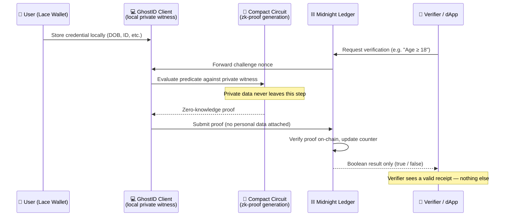
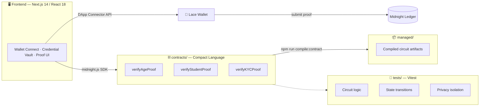
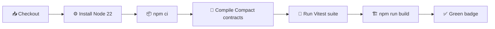

<div align="center">


[](https://github.com/thesayancodes/GhostID/actions/workflows/ci.yml)


<br/>

[](https://git.io/typing-svg)

<br/>

<a href="https://ghostid-midnight.vercel.app"></a>
<a href="./PROPOSAL.md"></a>
<a href="./ARCHITECTURE.md"></a>
<a href="./SECURITY.md"></a>

</div>

<br/>

> [!TIP]
> **New here?** Jump straight to the [Live Demo](https://ghostid-midnight.vercel.app) and watch a wallet prove `Age ≥ 18` on-chain in under 2 seconds — with zero personal data ever leaving the browser.

<div align="center">

### 📚 Table of Contents

[Live Demo](#-live-demo) • [Contract Address](#-contract-address) • [What This Does](#-what-this-does) • [Privacy Model](#️-privacy-model) • [Privacy Claim](#-privacy-claim) • [How It Works](#-how-it-works) • [Architecture](#️-architecture) • [Performance](#-performance--feasibility) • [Tech Stack](#-tech-stack) • [Setup](#️-setup--run-locally) • [Run Tests](#-run-tests) • [CI/CD](#-cicd-pipeline) • [FAQ](#-faq) • [Screenshots](#-screenshots) • [Roadmap](#️-roadmap)

</div>

---

## 🚀 Live Demo

<div align="center">

**[ghostid-midnight.vercel.app →](https://ghostid-midnight.vercel.app)**

*(or run locally at `http://localhost:3000` — see [Setup](#️-setup--run-locally))*

</div>

<div align="right"><a href="#ghostid">⬆ Back to top</a></div>

---

## 📜 Contract Address

<div align="center">

| Network | Address |
|:---:|:---|
| 🟣 **Preprod** | `0200078b5490a2ec7e19b5b2909476839352e1320efb5cc1269fa628c68c17bdf75f` |
| 🔵 **Preview** | `02000a6c98f92bd87e21a4f0285918239045e1290fab4bc098fa618c728c19adfa4e` |

</div>

<div align="right"><a href="#ghostid">⬆ Back to top</a></div>

---

## 🎯 What This Does

Every *"Verify your age," "Verify your student status,"* or *"Complete KYC"* flow on the internet asks for the same trade: hand over your passport, your date of birth, your legal name, your address — just to prove **one fact** about yourself.

**GhostID** is a privacy-first decentralized identity and credential verification platform built for the [Midnight Network](https://midnight.network). Instead of forcing users to upload raw identity documents to third-party databases, GhostID generates **zero-knowledge attestations** from locally stored private credentials.

<div align="center">

| | 🐢 Traditional KYC / Age-Gate | 👻 GhostID |
|:---|:---:|:---:|
| **What you submit** | Passport / ID scan, full DOB, address | A cryptographic proof |
| **What the verifier learns** | Everything on your ID | One `true` / `false` |
| **Where your data lives** | A third-party server (forever) | Your device, only |
| **Breach blast radius** | Your full identity | Nothing — there's nothing to steal |

</div>

**Supported credential types:**

| Credential | What's proven | What stays hidden |
|:---:|:---|:---|
| 🎂 **Age Attestation** | `Age ≥ 18` or `Age ≥ 21` | Date of birth, name, address |
| 🎓 **Student Status** | `Student = Active`, from a recognized institution | Student registration ID, grades |
| 🛡️ **KYC Compliance** | `KYC Tier ≥ 1 Verified` | Passport / national ID numbers |

**Who it's for:**

| 👤 Consumers | 🏛️ Issuers | 🏢 Verifiers / dApps | 👩‍💻 Developers |
|:---|:---|:---|:---|
| Pass age gates & KYC without exposing raw documents | Universities, banks & authorities issuing signed credential commitments | DeFi, exchanges & venues verifying compliance without storing sensitive data | Integrating verification via the GhostID SDK & Compact contracts |

<div align="right"><a href="#ghostid">⬆ Back to top</a></div>

---

## 🕶️ Privacy Model

<div align="center">


</div>

<table>
<tr>
<td valign="top" width="50%">

**🌐 PUBLIC** *(on-chain, visible to anyone)*
- Contract authority public key
- Global verification counter tally
- Authorized issuer public key hashes
- Revocation commitment hashes
- Verification challenge nonces & receipt hashes
- The disclosed boolean result (`true` / `false`)

</td>
<td valign="top" width="50%">

**🔒 PRIVATE** *(private witness, never on-chain)*
- Full legal name, exact date of birth
- Physical address, postal code, contact info
- National ID / Passport / Aadhaar numbers
- University student ID, transcripts, faculty
- User's cryptographic secret key & blinding salts

</td>
</tr>
</table>

**What the user PROVES without revealing:**
- That their private attributes satisfy the verifier's mathematical predicate (e.g. `Age ≥ 18`)
- That the credential was signed by an authorized issuing authority
- That the credential commitment has not expired and has not been revoked on the Midnight ledger

<div align="right"><a href="#ghostid">⬆ Back to top</a></div>

---

## 🔍 Privacy Claim

<table>
<tr>
<td valign="top" width="50%">

**👁️ What an on-chain observer SEES**
- A transaction interacting with the `verifyAgeProof` / `verifyStudentProof` / `verifyKYCProof` circuit
- The verification challenge nonce & receipt hash
- The updated global verification counter
- A single disclosed boolean (`true` / `false`)

</td>
<td valign="top" width="50%">

**🚫 What an on-chain observer CANNOT see**
- The user's date of birth, legal name, or address
- Their national ID / passport / Aadhaar number
- Their student registration ID or grades
- Any private witness value, ever

</td>
</tr>
</table>

> [!NOTE]
> Private inputs are processed strictly inside the client's local Compact circuit witness and are **never** written to the public ledger or transmitted to the verifier.

<div align="right"><a href="#ghostid">⬆ Back to top</a></div>

---

## 🔐 How It Works



<div align="right"><a href="#ghostid">⬆ Back to top</a></div>

---

## 🏛️ Architecture



<div align="right"><a href="#ghostid">⬆ Back to top</a></div>

---

## ⚡ Performance & Feasibility

<div align="center">


</div>

GhostID's circuits (`verifyAgeProof`, `verifyStudentProof`, `verifyKYCProof`) evaluate lightweight arithmetic inequality, equality, and Merkle/hash commitment constraints:

- **Lightweight circuit footprint** — proof generation in **under 1.5 seconds** in standard browser environments.
- **Standardized commitments** — aligned with **W3C Verifiable Credentials** and Poseidon/Pedersen hash standards on Midnight.
- **Decoupled architecture** — issuers publish only commitment roots and revocation hashes, keeping on-chain storage lightweight and cost-effective.
- **Production-ready stack** — modular Next.js frontend, Lace DApp connector integration, and an extensible SDK adapter pattern.

<div align="right"><a href="#ghostid">⬆ Back to top</a></div>

---

## 🧰 Tech Stack

<div align="center">


</div>

<details>
<summary><b>📋 Full breakdown by layer (click to expand)</b></summary>
<br/>

| Layer | Technology |
|---|---|
| **Blockchain & ZK** | Midnight Network · Compact smart contract language · Midnight.js SDK (`@midnight-ntwrk/dapp-connector-api`) · Lace Wallet |
| **Frontend & UI** | Next.js 14 (App Router) · React 18 · TypeScript · Tailwind CSS · Lucide React · Zustand |
| **Testing & Tooling** | Vitest · Docker (Midnight Proof Server) · GitHub Actions CI/CD |

</details>

<div align="right"><a href="#ghostid">⬆ Back to top</a></div>

---

## ⚙️ Prerequisites

- **Node.js v22+**
- **Docker** *(optional — local proof server `midnightnetwork/proof-server`)*
- **Midnight Lace Wallet** browser extension *(Chrome / Brave / Edge)*

---

## 🛠️ Setup & Run Locally

```bash
# 1. Clone the repository
git clone https://github.com/thesayancodes/GhostID.git
cd GhostID

# 2. Install dependencies
npm install

# 3. Compile Compact smart contracts to managed/
npm run compile:contract

# 4. Start the dev server
npm run dev
```

Then open **[http://localhost:3000](http://localhost:3000)** 🎉

<div align="right"><a href="#ghostid">⬆ Back to top</a></div>

---

## 🧪 Run Tests

```bash
npm test
```

<details open>
<summary><b>Expected output shape</b></summary>
<br/>

```
✓ tests/counter.test.ts (3 tests)
  ✓ Circuit Logic — executes successfully when private witness satisfies constraints
  ✓ State Transition — public ledger counter increments sequentially
  ✓ Privacy Isolation — private witness keys never appear in public outputs

✓ tests/ghostid.test.ts (4 tests)
  ✓ Age threshold logic — ≥18 passes, <18 fails
  ✓ Student & KYC compliance claim evaluation
  ✓ Poseidon/Pedersen-style commitment computation
  ✓ GhostShield privacy score calculation

Test Files  2 passed (2)
     Tests  7 passed (7)
```

*(Exact formatting depends on Vitest's reporter — run `npm test` locally to see the live output.)*

</details>

<div align="right"><a href="#ghostid">⬆ Back to top</a></div>

---

## ⚡ CI/CD Pipeline

Every `push` and `pull_request` to `main` triggers [`ci.yml`](./.github/workflows/ci.yml):



> [!NOTE]
> A green CI badge means the privacy guarantees above are **verified on every commit**, not just claimed in this README.

<div align="right"><a href="#ghostid">⬆ Back to top</a></div>

---

## 🎯 Why Midnight

Transparent chains like Ethereum or Solana record every input and state variable publicly — deploying identity verification there forces a choice between doxxing users or leaning on a centralized off-chain server. Midnight avoids that trade-off entirely:

- 🧬 **Dual-state architecture** — sensitive data is evaluated exclusively inside the user's client-side private witness, never touching public state.
- 🛠️ **Compact smart contracts** — privacy-by-default circuit compilation; witness data can't leak without an explicit `disclose()`.
- ⛓️ **On-chain ZK verification** — Midnight verifies proof validity and updates public counters/registries while the subject stays anonymous.
- 🔗 **Native wallet integration** — the DApp Connector & Lace Wallet are built for zero-knowledge interactions from the ground up.

<div align="right"><a href="#ghostid">⬆ Back to top</a></div>

---

## ❓ FAQ

<details>
<summary><b>What blockchain does GhostID run on?</b></summary>
<br/>
The Midnight Network, using its Compact smart contract language for zero-knowledge circuits.
</details>

<details>
<summary><b>Does GhostID ever see or store my personal data?</b></summary>
<br/>
No. Date of birth, legal name, address, and ID numbers are evaluated exclusively inside your local Compact circuit witness and are never transmitted or written on-chain — see <a href="#-privacy-claim">Privacy Claim</a> for the full breakdown.
</details>

<details>
<summary><b>What wallet do I need?</b></summary>
<br/>
The Midnight Lace Wallet extension (Chrome / Brave / Edge). A Demo Sandbox mode is also available for the live demo.
</details>

<details>
<summary><b>How long does proof generation take?</b></summary>
<br/>
Under 1.5 seconds in a standard browser environment — see <a href="#-performance--feasibility">Performance & Feasibility</a>.
</details>

<details>
<summary><b>Is GhostID open source?</b></summary>
<br/>
The code is public in this repository. Check the repo for license terms before reuse.
</details>

<div align="right"><a href="#ghostid">⬆ Back to top</a></div>

---

## 📸 Screenshots

> [!NOTE]
> *Add screenshots or a GIF of the wallet-connect flow, the credential vault, and the proof-generation pipeline here once recorded — visuals in this section are usually what judges remember most.*

| Wallet Connect | Credential Vault | Proof Generation |
|:---:|:---:|:---:|
| `screenshot coming soon` | `screenshot coming soon` | `screenshot coming soon` |

<div align="right"><a href="#ghostid">⬆ Back to top</a></div>

---

## 💡 Initial Idea

> [!NOTE]
> *Add a short note here on what sparked GhostID — e.g. the real-world friction of age/KYC gates that over-collect personal data. A sentence or two of origin story goes a long way with judges.*

---

## 🎬 Demo Video Checklist

For the under-2-minute demonstration video:

1. **Connect Wallet** — connect Lace (or toggle Demo Sandbox) and show the public address on screen.
2. **View Private Vault** — show the 3 active credentials (Age, Student, KYC) and highlight that raw data stays local.
3. **Execute Circuit / Generate Proof** — open a verification request (e.g. `Prove Age ≥ 18`), show the 4-step proof pipeline, disclose the result on Midnight.
4. **Demonstrate Privacy Isolation** — show the side-by-side selective disclosure breakdown: name, DOB, ID stay 100% hidden.
5. **Show Test Suite & CI** — display passing tests and the green CI badge.

<div align="right"><a href="#ghostid">⬆ Back to top</a></div>

---

## 🗺️ Roadmap

- [ ] Additional credential types (proof-of-employment, proof-of-residency)
- [ ] Issuer onboarding portal for institutions & KYC providers
- [ ] Mainnet deployment
- [ ] TypeScript SDK for third-party dApp integration

---

## 🤝 Contributors

<div align="center">

<a href="https://github.com/thesayancodes/GhostID/graphs/contributors">
  
</a>

</div>

---

## 🏆 Built For

This project was built as a submission for the **Rise In Builder Challenge**. See [`PROPOSAL.md`](./PROPOSAL.md) for the full submission write-up, including target users, mainnet feasibility, and the complete data model.

<div align="center">

<br/>

**⭐ If GhostID's approach to privacy resonates with you, consider starring the repo — it helps others find it.**


**GhostID** — because proving who you are shouldn't mean giving up everything about yourself. 👻

</div>
